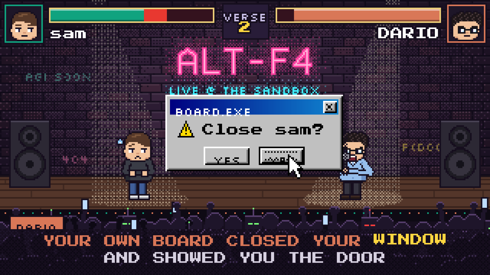

# ALT-F4: Sam vs Dario



A satirical AI-industry rap battle, *Dario vs Sam*, made into a 16-bit fighting-game music video. The song was made with Suno. The characters trade verses on a club stage while health bars drain on every punchline. Each lyric line gets its own visual gag, and it ends in a double K.O.

- 320×180 native resolution, drawn procedurally, scaled up 6× (nearest-neighbour) to 1920×1080, 24 fps, 3:20
- Parody and satire. Not affiliated with or endorsed by OpenAI, Anthropic, or anyone depicted. These are cartoon caricatures, and every line is a joke, not a factual claim.

## Rendering

The song is not in git. Put it at `audio/song.wav`. Then, from the repo root:

```sh
uv run python -m pixelart.render  projects/alt-f4            # -> projects/alt-f4/alt-f4.mp4
uv run python -m pixelart.preview projects/alt-f4 hook 88:95:1
uv run python projects/alt-f4/thumbnail.py                    # -> thumbs/
```

To load only some gag modules while you work on them, set `GAGS_ONLY=gags_v1,gags_misc`.

## Files

| File | Role |
| --- | --- |
| `project.py` | Settings read by the pixelart tools |
| `engine.py` | Canvas size, palette and brand colours, bound onto `pixelart.pixel` |
| `timeline.py` | Beat clock, sections, lyric lookups, punchline hits and HP, vocal loudness |
| `characters.py` | Procedural chibi Sam and Dario: heads, expressions, poses |
| `scene.py` | Venue, crowd, HUD, pop-up windows and style stills |
| `props.py` | Gag props and UI widgets |
| `video.py` | Frame renderer: camera, shots per section, karaoke, hit effects, cold open, ending |
| `gagkit.py`, `gags*.py` | Per-lyric-line gags (generators that yield their drawing phase) |
| `thumbnail.py` | YouTube thumbnails (`thumbs/`, with the upload text in `thumbs/youtube_upload.txt`) |
| `align.py`, `transcribe.py` | This song's lyric timing, built on `pixelart.audio` |
| `lyrics.txt` | The lyric sheet |
| `data/` | Beat grid, Whisper transcripts, timed lyrics, vocal envelope |

## Timing quirks

- The Suno render is spliced at about 85.5 s, so the beat grid comes from beat_this, not a fixed BPM. `timeline.py` drops one spurious downbeat at the splice and two at the tail.
- Whisper can't hear the hook chant, so those lines are timed by hand in `align.py`. The intro onsets are also corrected there from the vocal-stem loudness.
- There is a click at 199.76 s, so `END` is 199.75.
